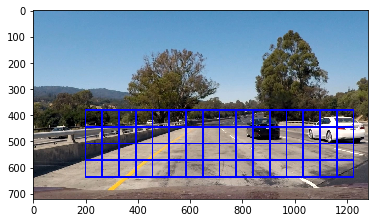
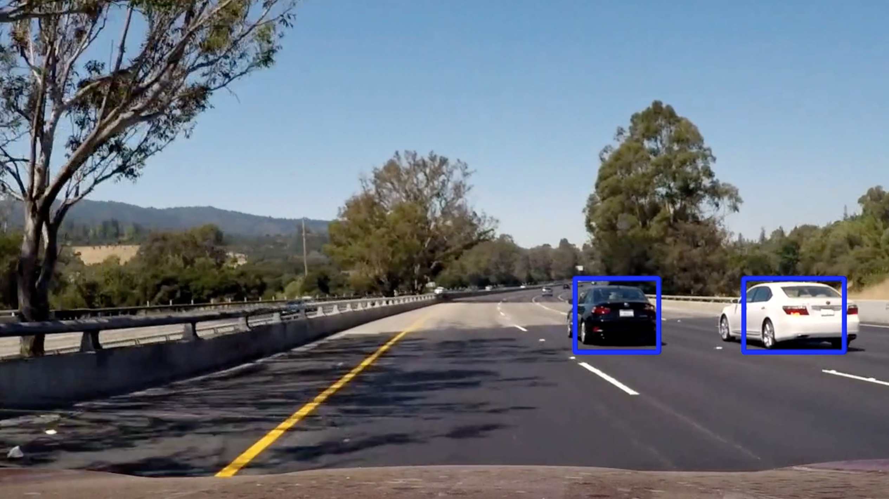
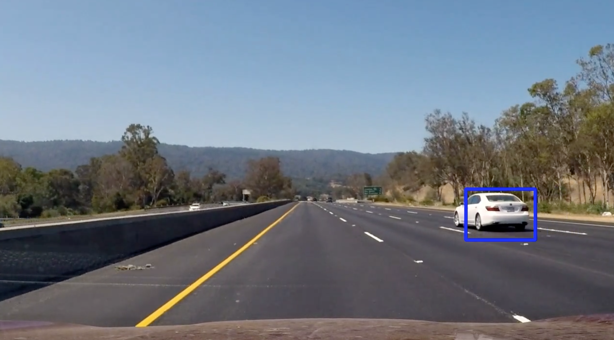
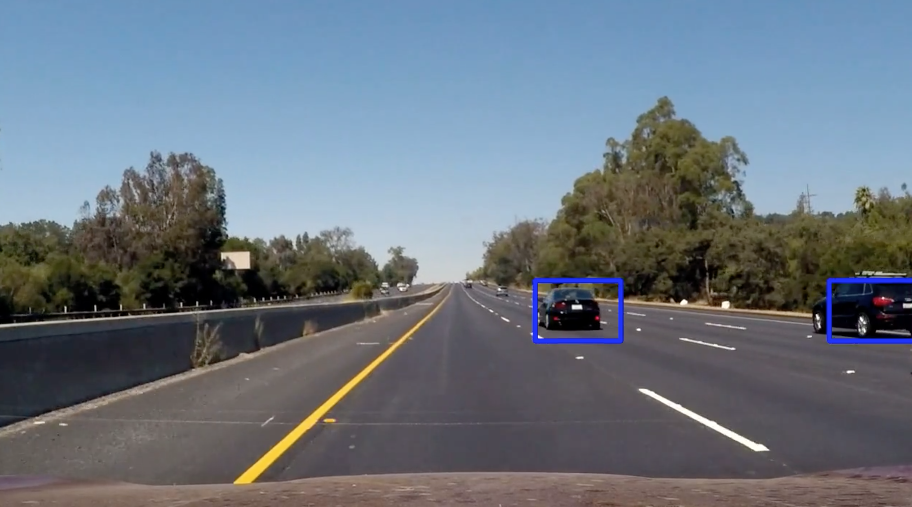

**Vehicle Detection Project**

The goals / steps of this project are the following:

* Perform a Histogram of Oriented Gradients (HOG) feature extraction on a labeled training set of images and train a classifier Linear SVM classifier
* Optionally, you can also apply a color transform and append binned color features, as well as histograms of color, to your HOG feature vector.
* Note: for those first two steps don't forget to normalize your features and randomize a selection for training and testing.
* Implement a sliding-window technique and use your trained classifier to search for vehicles in images.
* Run your pipeline on a video stream (start with the test_video.mp4 and later implement on full project_video.mp4) and create a heat map of recurring detections frame by frame to reject outliers and follow detected vehicles.
* Estimate a bounding box for vehicles detected.

[//]: # (Image References)
[image1]: ./examples/car_vs_car.png
[image2]: ./examples/HOG.png
[image3]: ./examples/sliding_windows.jpg
[image4]: ./examples/sliding_window.jpg
[image5]: ./examples/bboxes_and_heat.png
[image6]: ./examples/labels_map.png
[image7]: ./examples/output_bboxes.png
[video1]: ./project_video.mp4

## [Rubric](https://review.udacity.com/#!/rubrics/513/view) Points
### Here I will consider the rubric points individually and describe how I addressed each point in my implementation.  

---
### Writeup / README

#### 1. Provide a Writeup / README that includes all the rubric points and how you addressed each one.  You can submit your writeup as markdown or pdf.  [Here](https://github.com/udacity/CarND-Vehicle-Detection/blob/master/writeup_template.md) is a template writeup for this project you can use as a guide and a starting point.  

You're reading it!

### Histogram of Oriented Gradients (HOG)

#### 1. Explain how (and identify where in your code) you extracted HOG features from the training images.

The code for this step is contained in the second code cell of the IPython notebook.

I started by reading in all the `vehicle` and `non-vehicle` images.  Here is an example of one of each of the `vehicle` and `non-vehicle` classes:

![alt text][image1]

I then explored different color spaces and different `skimage.hog()` parameters (`orientations`, `pixels_per_cell`, and `cells_per_block`).  I grabbed random images from each of the two classes and displayed them to get a feel for what the `skimage.hog()` output looks like.

Here is an example using the `YCrCb` color space and HOG parameters of `orientations=8`, `pixels_per_cell=(8, 8)` and `cells_per_block=(2, 2)`:

#### 2. Explain how you settled on your final choice of HOG parameters.

I tried various combinations of parameters and figure out the following parameters that perform the best.

| Parameter        | Value           |
| ------------- |:-------------:|
|color_space    | 'YCrCb'|
|orient         |   9    |
|pix_per_cell   |   8    |
|hog_channel    |   ALL  |
|cell_per_block |   2    |
|spatial_size   | (16, 16)|
|hist_bins      |   16    |
|spatial_feat   |   True  |
|hist_feat      |   True  |
|hog_feat       |   True  |

#### 3. Describe how (and identify where in your code) you trained a classifier using your selected HOG features (and color features if you used them).

I trained a linear SVM under `model.py`. The feature was generated using the `extract_features` defined from line 78 through 117 under `vehicle_detect.py`. I didn't use any other fancy machine techniques like ensembling or stacking. The reason is those features are continuous so tree based model might not working well here. Then I used Bayesian Optimization to find the best parameters for my LinearSVC model and dump it to a file called `svc_pickle.p`.

### Sliding Window Search

#### 1. Describe how (and identify where in your code) you implemented a sliding window search.  How did you decide what scales to search and how much to overlap windows?

The code can be found from line 161 through 199 under `vehicle_detect.py`. I ended up using just one scale and x-offset equal to 200. I will discuss the reason in the later part.

#### 2. Show some examples of test images to demonstrate how your pipeline is working.  What did you do to optimize the performance of your classifier?

I tried searching on two scales at the beginning but it gives me too many false negatives that messed up the whole pipeline. I ended up using only one scale with YCrCb 3-channel HOG features plus spatially binned color and histograms of color in the feature vector, which provided a nice result.  Here are some example images:

---

### Video Implementation

#### 1. Provide a link to your final video output.  Your pipeline should perform reasonably well on the entire project video (somewhat wobbly or unstable bounding boxes are ok as long as you are identifying the vehicles most of the time with minimal false positives.)
Here's a [link to my video result](./project_video_out.mp4)

#### 2. Describe how (and identify where in your code) you implemented some kind of filter for false positives and some method for combining overlapping bounding boxes.

I recorded the positions of positive detections in each frame of the video.  From the positive detections I created a heatmap and then thresholded that map to identify vehicle positions.  I then used `scipy.ndimage.measurements.label()` to identify individual blobs in the heatmap.  I then assumed each blob corresponded to a vehicle.  I constructed bounding boxes to cover the area of each blob detected. One thing I encountered through the debugging process is my classifier always identify cars coming from the other direction, which is not a bad thing since they are true cars. However, it might not be helpful for the car to make decision. I will talk about it in discussion.

Here's an example result showing the heatmap from a series of frames of video, the result of `scipy.ndimage.measurements.label()` and the bounding boxes then overlaid on the last frame of video:

### Here are six frames and their corresponding heatmaps:

### Here the resulting bounding boxes are drawn onto the last frame in the series:
The final pipeline is wrapped in a function called `carDetectionPipeline` under `main.py`.

---

### Discussion

#### 1. Briefly discuss any problems / issues you faced in your implementation of this project.  Where will your pipeline likely fail?  What could you do to make it more robust?

My pipeline seems to be working most of the time. However one thing that it is not doing well is identifying cars that are close to myself. If you drive in real life, you would understand that it could be extremely dangerous. I did try different scale for each region, but it will cause too many false negative prediction. I will keep working on that. One thing I did on purpose to get rid of the cars that are coming from the other direction is start sliding window from x=200, which I don't believe is a general solution. Let say you are driving on a relative small road, not the highway in California. You do need to identify them to make sure you stay far enough from the middle of the road. However, it might be a noise if you drive on the highway.
